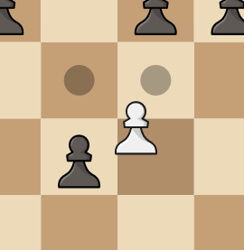

# chess ♟

**A 2 player chess game made using:**

- [cm-chessboard](https://github.com/shaack/cm-chessboard)
- [chess.js](https://github.com/jhlywa/chess.js)

## Features

- **Game Over Detection**
  - Checkmate
  - Draw
  - Stalemate
  - Threefold Repetition
- **Special Moves**
  - Castling - Kingside and Queenside
  
  - En Passant
  
  - Pawn Promotion - Promotion based on user's choice
  
- **Game data can be retrieved using _chessData_ object in console**
  - ```chessData.FEN``` : current board configuration in FEN
  - ```chessData.PGN``` : last move made by player in PGN
  - ```chessData.state```
    - 0 : game in progress
    - 1 : draw
    - 2 : win/loss
  - ```chessData.turn```
    - 1 : white
    - 2 : black

Try it here: [https://unshdee.github.io/chess/](https://unshdee.github.io/chess/)
